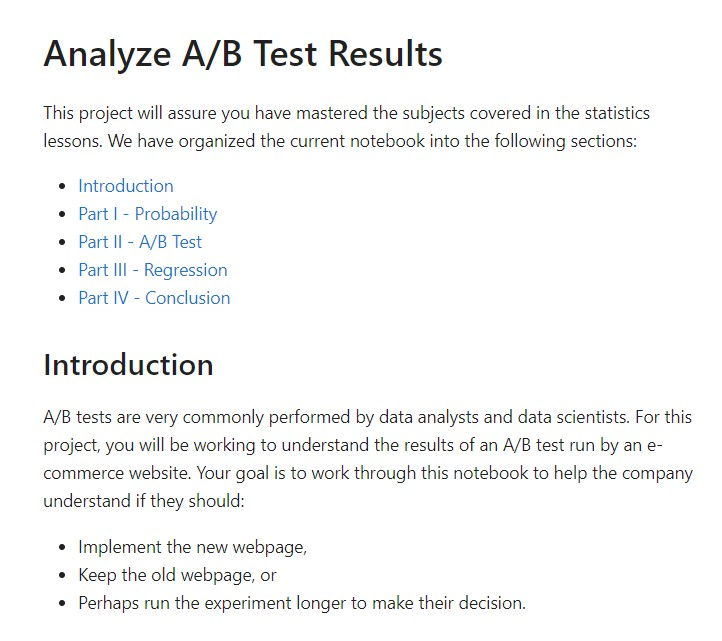
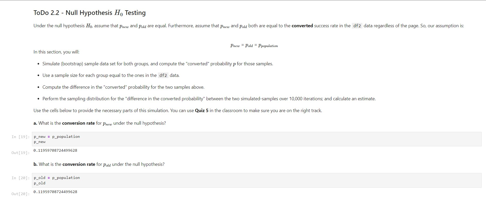
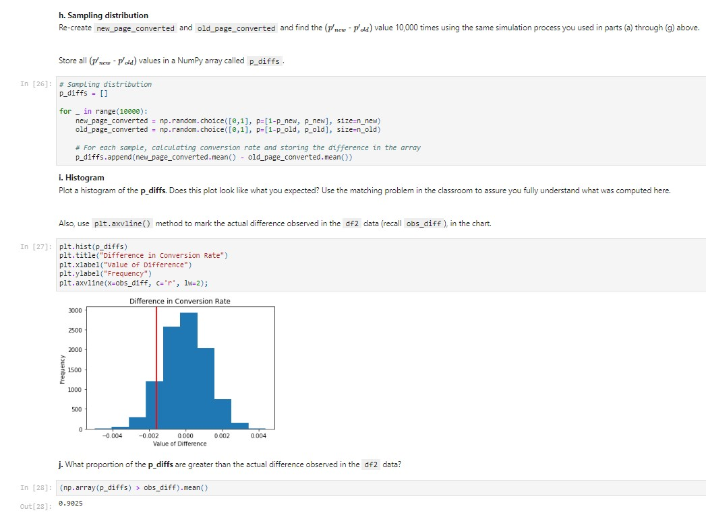
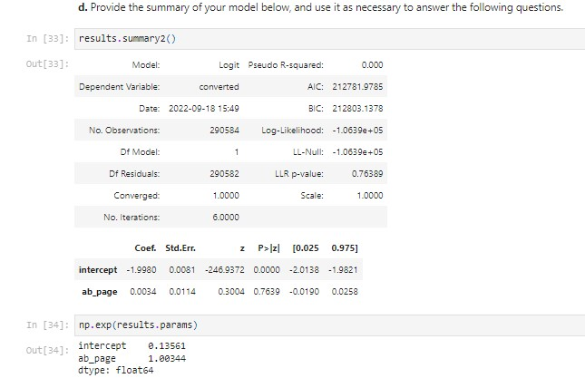
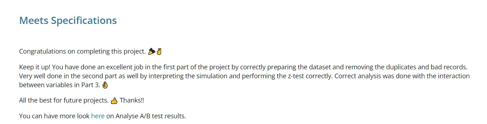
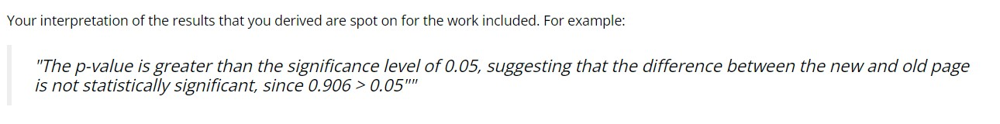
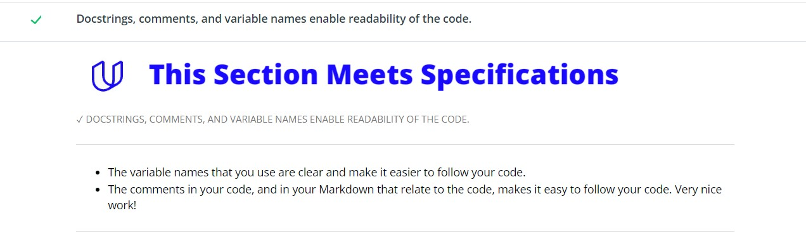
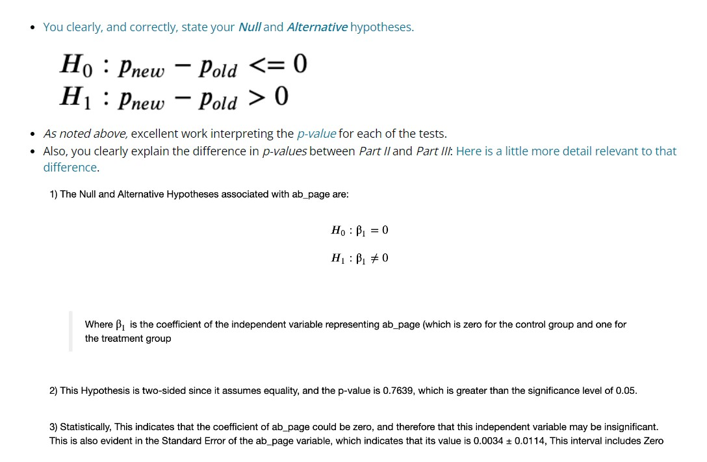

# Analyze A/B Test Results

This Project is a part of the Udacity Data Analysis Nanodegree

# Overview

This project analyzes the results of an A/B test run by an e-commerce website to help the company understand if they should implement a new homepage, keep the old page, or perhaps run the experiment longer to make their decision.

# Tools Used

 

 

 

 

# Features

- The Dataset is **explored**
- Irregularities are removed to **clean** the dataset
- The Dataset is sampled to create a **sampling distribution**
- **Hypothesis Tests** are performed to know if the new page drove higher conversion rates than the old page
- Multiple **Logistic Regression** Models are fitted to verify the results

# Screenshots

# Feedback

